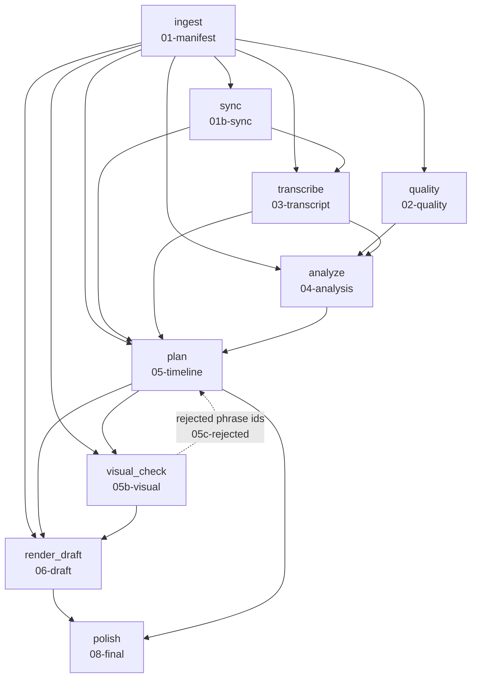

# VideoAI

VideoAI turns a folder of raw clips from a child's toy review into a cut draft
video. You point it at a project folder; it ingests the footage, transcribes
it, decides what belongs in the edit, checks what it picked actually looks
right, and renders a draft. Every decision along the way — every score, every
cut, every rejection — is written to disk as a plain, readable JSON file under
`work/`, so nothing the pipeline decided is hidden from you.

## Requirements

- macOS on Apple Silicon (speech recognition runs on the GPU via MLX)
- ffmpeg 8.x (`brew install ffmpeg`)
- Python 3.13 via uv (`brew install uv`)
- Claude Code CLI or Codex CLI, authenticated (analysis and planning use the
  selected subscription-backed CLI; Claude is the default)

## Setup

```bash
uv venv --python 3.13
uv sync
cp .env.example .env   # then fill in the keys you have (all optional today)
```

The default `providers.llm: claude_cli` uses Claude Max without an API key.
You can switch to the authenticated OpenAI subscription-backed CLI without
changing the pipeline:

```yaml
providers:
  asr: parakeet
  llm: codex_cli
```

Codex runs ephemerally and read-only, receives the same prompts and reference
frames, and is asked only for the JSON artifact. This is also useful for
comparing Claude and Codex on the same project without adding a metered API.

## Project layout

A project is a folder. The pipeline adapts to how you already have it organized
rather than asking you to reorganize your footage:

```
projects/my-review/
  video/                 # or input/ — either name works
    cam-a/                # per-camera subfolder (optional)
    cam-b/
  project.yaml            # the brief: title, arc, must_include, avoid, notes...
  notes.md                 # free-form notes, optional
  description/               # longer brief material, optional — .md, .txt, .docx
```

Clips can also sit loose, directly in the project folder, with no `video/` or
`input/` subfolder at all — a flat folder of clips is treated as one camera
named `main`. Loose clips and per-camera subfolders can be mixed. The pipeline
only ever looks at video files and text; anything else in the project folder is
ignored, and its own `work/` and `output/` folders are never mistaken for
another camera.

`project.yaml` is the only file worth writing by hand. See
[`docs/project-yaml-example.yaml`](docs/project-yaml-example.yaml) for a filled-in
brief: an `arc` (the sequence of beats you actually shot, which the planner
follows instead of inventing its own structure), a `must_include` list of
moments that must survive the edit, and an `avoid` list of things that must
never reach the final video.

Running the pipeline creates two more folders next to the brief:

- `work/` — every stage's artifact (JSON), plus derived media it caches
  (audio, proxies, keyframes, rendered segments). Safe to delete entirely;
  everything rebuilds from the source clips.
- `output/` — the review draft, contract-validated `final.mp4`, captions,
  metadata, and the machine-readable production report.

## Running it

```bash
uv run videoai produce projects/my-review --config config.yaml
open projects/my-review/output/draft.mp4
uv run videoai approve projects/my-review --config config.yaml
uv run videoai produce projects/my-review --config config.yaml
```

`produce` is the normal creator command. On its first run it executes the
provider-independent pipeline only through the review draft and tells you how
to approve it. Approval is bound to the exact timeline, rendered draft, and
effective configuration. After approval, the second run builds and fully
validates the delivery. The required phases and features are defined once in
[`PRODUCTION-CONTRACT.md`](PRODUCTION-CONTRACT.md); both `AGENTS.md` and
`CLAUDE.md` are symbolic links to that file, so Codex and Claude follow the
same workflow.

Use the lower-level `run` command for diagnosis and individual-stage work.
`--auto-fix N` closes the loop around the visual check described below: when a
chosen shot turns out to have an adult filling the frame, or to be unusable,
the segment is withheld and the edit is planned again without it, at most N
times. Without it (the default, `--auto-fix 0`) the run stops the first time
that happens and names every rejected segment, so you can decide what to do
about it yourself.

Other useful commands:

```bash
uv run videoai stages                                          # pipeline order
uv run videoai run projects/my-review --stage plan --force     # re-run one stage
uv run videoai run projects/my-review --debug                  # keep the traceback on failure
uv run videoai config                                          # effective configuration
```

## Pipeline

Ten stages run in this order, each reading artifacts written by the stages
before it and writing exactly one artifact of its own under `work/`.



The dotted line is the auto-fix loop: `visual_check` doesn't feed `plan`
directly in the dependency graph (that would make the graph circular), but a
fresh rejection changes `plan`'s cache fingerprint, so re-running the pipeline
after a rejection re-plans without the rejected material.

The examples below are drawn from this project's own real test footage: a
toy review shot on 13 clips totalling 28.8 minutes, edited down to a roughly
3.3-minute draft (`assets/1.Toy_Pimple_Popping/`).

### ingest — `01-manifest`

Indexes every clip: probes it with `ffprobe` for duration, resolution, frame
rate and whether it has audio; pulls out a normalized 16 kHz mono WAV (loudness
normalized to EBU R128) for speech recognition; and builds a smaller proxy
video at `render.draft_height` (720p by default) that every later stage — quality
scoring, keyframe extraction, the actual draft render — works from instead of
the original 4K source. Proxies are hardware-encoded through VideoToolbox when
available, which is minutes of difference per clip versus software encoding.

Reads the source video files. Writes `01-manifest.json` (one entry per clip:
id, path, duration, dimensions, fps, camera, recording timestamp if present,
and the paths of its derived audio and proxy) plus the derived media itself
under `work/media/`. Runs entirely locally with `ffmpeg`/`ffprobe`. Cost: $0.

### quality — `02-quality`

A deterministic technical gate, before any model looks at the footage at all.
Samples 12 frames evenly across each clip's proxy and measures blur (Laplacian
variance — a genuinely out-of-focus frame has much less high-frequency detail
than a sharp one), motion (how much the picture changes between samples), and
how often the frame is essentially black. A clip is flagged unusable only when
it is very blurry or mostly black; the cutoffs are deliberately conservative —
tuned against this project's real 4K iPhone footage so ordinary handheld
softness never gets misread as a defective clip. This score is handed to
`analyze` as context, not used to silently drop footage.

Reads `01-manifest`. Writes `02-quality.json` (blur/motion/black-ratio scores
and a usable flag per clip). Runs locally with OpenCV. Cost: $0.

### sync — `01b-sync`

Two cameras rolling on the same moment produce the same words twice; without a
shared timeline, nothing downstream can tell "a second angle on this line"
apart from "a second attempt at this line." This stage places every clip,
across every camera, on one shared project timeline. It starts from each
clip's own `creation_time` file metadata where present — per clip, not per
camera, so one clip losing its timestamp (re-encoded, AirDropped, edited)
doesn't throw off every other real timestamp on that camera — and refines
multi-camera alignment by cross-correlating each camera's audio loudness
envelope against a reference camera, keeping only an alignment whose peak
correlation clearly beats its next-best rival. It also decides which camera
actually has a working microphone on it (the one whose audio is reliably
louder on average) — that's the one `transcribe` will use.

Reads `01-manifest`. Writes `01b-sync.json` (each clip's camera, its position
on the shared timeline, how that position was determined, and which camera is
"primary"). Runs locally with numpy. Cost: $0.

### transcribe — `03-transcript`

Word-level, verbatim speech-to-text on the primary camera's audio, using
parakeet-mlx running locally on the Apple Silicon GPU. Two reasons it runs
locally rather than through a paid API: it's free, and its output stays
verbatim — every disfluency, restart and stutter survives into the transcript,
which is exactly the signal the take-detection and failed-take scoring later
in the pipeline need. A cleaned-up transcript would erase the evidence used to
tell a repeated attempt at a line from a finished one. Long clips are
transcribed in overlapping chunks (120 seconds with a 15-second overlap by
default) so a single clip never has to fit in one GPU memory buffer — this
project's own 18-minute clip (`clip-08`, 1,082 seconds) once crashed the whole
run before that chunking was wired through; see Troubleshooting below.

Reads `01-manifest` and `01b-sync` (to know which camera to transcribe).
Writes `03-transcript.json` (a word list with start/end times per clip, plus
speech spans derived from gaps between words). Cost: $0, GPU time only.

### analyze — `04-analysis`

Claude (Sonnet, via the Claude Code CLI, under your Claude subscription rather
than a metered API key) reads the whole transcript — split into phrases, not
sentences; see below — plus the technical quality report, the take-group
guesses, and your brief, and scores every phrase for delivery, visual
interest, emotion, who's speaking, whether it's a failed take, and whether it
stands on its own as a short. It never watches video for this: the only
picture it ever sees here is one still frame per phrase, sampled at that
phrase's midpoint, and only if `analyze.keyframes_per_phrase` is on. Separately,
it looks at three sampled frames from each silent clip (see inserts, below)
and writes one sentence describing what that clip physically shows, since
those clips carry no words for the planner to go on otherwise.

Phrases, not sentences, are the unit here and everywhere downstream: a phrase
boundary is wherever the transcript has a gap longer than
`transcribe.phrase_gap_seconds` (0.5s by default) or a run gets too long
(`transcribe.max_words_per_phrase`, 30 words). That guarantees every phrase
boundary sits in actual silence, which makes it a safe place to cut — a
grammatical sentence boundary makes no such promise, since a real sentence can
run straight through a pause or be spoken with no pause at its edges at all.

Reads `01-manifest`, `02-quality`, `03-transcript`, and your brief. Writes
`04-analysis.json` (a score per phrase, plus the list of silent inserts), and
along the way also writes `03b-phrases.json` and `03c-takes.json` — the phrase
index and the take-group guesses, kept as non-fingerprinted derived views so
you can read them without re-deriving them by hand. On the real project this
stage scored 205 phrases and identified 2 groups of probably-repeated takes.
Cost: $0 under a Claude subscription (would be metered per call on API
pricing).

### plan — `05-timeline`

Claude is given the scored phrases (minus anything you've excluded and
anything a previous visual check has already rejected — see below) and the
silent inserts with their descriptions, and picks and orders phrase ids into
named sections, following your brief's `arc` and `must_include` list when you
gave one. That's the only part a model decides. Turning the chosen phrase ids
into an exact timeline — padding each cut outward toward silence, never into
a neighbouring word, computing real offsets and durations — is arithmetic on
the actual transcript, done in code, not a number the model wrote down.

Before this stage will accept the result, `validate_timeline` checks it
against hard rules: every cut lands in silence, never inside a word; every
segment is long enough to be a real cut, not a sliver; every segment's quoted
text is actually found in that time range of that clip's transcript; the
timeline is contiguous; and every source clip in it shares the same real pixel
geometry and frame rate as the others (the render step concatenates rendered
segments with a raw stream copy, which silently produces a garbled file if
even one clip doesn't match). Any violation stops the stage before a bad
timeline is ever written — see Troubleshooting.

Silent inserts — clips too quiet to carry a phrase (see the analyze section
above) — are placed by the same model call, using `insert:<clip_id>` or
`insert:<clip_id>@<start>-<end>` in a section's phrase list, and matched to
what's being said around them by their one-sentence description rather than
by chronology alone: a close-up of the syringe filling the toy belongs next to
the line about filling it, wherever in the recording it happened to be shot.

Reads `01-manifest`, `01b-sync`, `03-transcript`, `04-analysis`, and
`05c-rejected` if the visual check has ever written one. Writes
`05-timeline.json`, plus `05a-storyplan.json` (title, description, tags and
named sections, as derived context). On the real project this picked 20
segments — 17 spoken phrases and 3 silent inserts — totalling about 199
seconds against a 180-second target. Cost: $0 under a Claude subscription.

### visual_check — `05b-visual`

Nothing before this point has ever looked at what a *chosen* speech segment
shows — `analyze` only ever sees stills for silent inserts, never for the
narrated phrases it scores from text alone. So an adult crossing the frame
mid-line, or a shot of the ceiling, would otherwise reach the final render
unseen. This stage samples three frames from inside each selected segment's
own span (not the source clip generally — the cut is what ships) and asks the
model what's actually in them: is another person filling the frame, is the
child visible, is the shot simply unusable. If `plan.reject_adult_in_frame` or
`plan.reject_unusable_shots` is on (both are, by default) and a segment trips
either one — or the model just says nothing about a segment, which counts
as a refusal too, since silence isn't the same as a clean bill of health —
the stage refuses to let the render happen. It writes the offending phrase ids
to `work/05c-rejected.json` so the next planning round doesn't get offered
them again, and names them in its error.

The reason this can't just exclude the one bad phrase and move on: the
planner would reach for its neighbour, which was very likely shot in the same
few seconds with the same person in the same position in frame.

Reads `01-manifest` and `05-timeline`. Writes `05b-visual.json` always, and
`05c-rejected.json` only when something is actually rejected. Cost: $0 under a
Claude subscription.

### render_draft — `06-draft`

Cuts each timeline segment out of its clip's proxy with a short audio fade at
both edges (and a per-beat volume adjustment if your brief's
`gain_db_by_beat` configures one), synthesizing a silent audio track for any
segment whose source clip has none — every segment needs the same audio
stream layout, because the final assembly step concatenates them with a raw
stream copy for speed, and a mismatched layout there produces a broken file
rather than an error. `visual_check` is a required input to this stage purely
to order it after the gate in the dependency graph; a check that could run
after the thing it's supposed to be guarding wouldn't be a gate.

Reads `01-manifest`, `05-timeline`, `05b-visual`. Writes the individual cut
segments under `work/segments/`, the final `output/draft.mp4`, and
`06-draft.json` (path, duration, segment count). Runs locally with `ffmpeg`.
Cost: $0.

### polish — `08-final`

Builds `output/final.mp4` beside the draft: the draft is what you watch to
check edit decisions, the final is what someone would actually sit through.
The draft itself is never touched.

**The final is cut from the original footage, not from the draft.** The draft
is assembled out of the 540p proxies because a review copy should be ready in
seconds; building the deliverable on top of it would ship a video with a
sixteenth of the pixels you shot. This stage has the manifest's original paths
and the timeline's exact in and out points, so it re-cuts every segment
straight from the source files at `polish.output_height` (1080 by default, a
clean downscale from 4K; set `2160` for true 4K) and `polish.output_crf` (18,
visually near-lossless, against the draft's 26), through VideoToolbox when
`polish.hardware_encode` is on and the build has it. Nothing is ever upscaled,
the finished frame keeps the source's aspect, and an original that has moved
stops the stage by name rather than quietly falling back to its proxy. Turned
footage needs no special handling: ffmpeg autorotates on decode whenever the
output goes through a filter chain, so a portrait clip stored as landscape
frames plus a display matrix arrives upright and is delivered upright.

With `polish.lossless_intermediates: true` (the default), selected source
ranges are cut to lossless x264 intermediates before composition. The final
delivery encode is therefore the only lossy video generation. This uses more
temporary disk space and CPU, but `work/polish/` is disposable.

The audio target is unchanged — AAC, 44100 Hz, mono, exactly what the draft
settled on — because the concat step depends on every segment agreeing on it.

The strict production path uses finite, independently testable passes instead
of one large ffmpeg graph. It cuts lossless source segments, builds a picture
master, renders a finite alpha graphics track, prepares finite music and
ducked-audio tracks, then performs one lossy H.264 delivery encode. This avoids
the deadlocks caused by unbounded loop inputs while preserving one-generation
picture quality.

The production layers are:

- **A title card** of `polish.intro_seconds`, carrying the title the planner
  wrote into `05a-storyplan`, plus an **outro card** of
  `polish.outro_seconds`.
- **A section title** wherever a timeline clip's beat differs from the one
  before it, naming that beat for `polish.title_seconds` behind a
  semi-transparent plate. It is a lower third: the plate sits inside the bottom
  title-safe area, below the presenter.
- **Word-timed captions** generated locally from `03-transcript.json`. They are
  grouped into compact chunks (`polish.caption_words`, four by default), mapped
  through cuts to delivery time and written to `output/final.srt`, ready for a
  viewer-controlled YouTube caption track. Set `polish.burn_captions: true`
  only when every phrase must be permanently rasterised into the picture, in
  which case the caption lane sits directly above the section-title lower third
  so the two can never collide. Neither mode depends on ffmpeg's optional libass or drawtext support.
- **A music bed** from `polish.music_dir`, chosen by your brief's `style`
  when that names a track the library has and otherwise by a stable digest of
  the project's name, so the same project always gets the same music. It is
  looped or trimmed to length, faded at both ends, laid in at
  `polish.music_gain_db` and ducked a further `polish.music_duck_db` under
  the speech by an ffmpeg `sidechaincompress` keyed on the video's own audio.
  Bensound's free licence wants a credit, so the track's attribution line is
  appended to `output/metadata.md` (once, however often you re-render) and
  recorded in the artifact.
- **A fade-through-black transition of `polish.transition_frames`** at story
  section boundaries. Cuts inside a section stay hard cuts.

With `polish.strict_contract: true`, required elements do not silently
degrade. Missing captions, music, closing beat, approval, resolution, or a
failed full decode makes production fail and prevents an invalid
`final.mp4`. The authoritative requirements are in
`production-contract.yaml`. Set strict mode false only for legacy preview/test
workflows; `videoai produce` refuses to run in that mode.

When `polish.require_approval: true`, delivery stops after the draft until the
creator approves the exact current timeline:

```bash
open projects/my-review/output/draft.mp4
uv run videoai approve projects/my-review --config config.yaml
uv run videoai produce projects/my-review --config config.yaml
```

Approval is stored in `work/06-approval.json` with hashes for the timeline,
draft file, and effective config. Any change to one of them requires a fresh
review.

Reads `01-manifest`, `05-timeline`, `05a-storyplan`, `06-draft`. Writes its own
delivery files under `work/delivery/`, `output/final.mp4`,
`output/final.srt`, `output/production-report.json`, the music credit in
`output/metadata.md`, and `08-final.json`. The renderer then decodes the whole
file before publishing success. Runs locally with OpenCV and ffmpeg. Cost: $0
in money and real time in minutes.


## Caching

Every stage's artifact carries a fingerprint, and a stage only re-runs when
that fingerprint would actually change — not just when its inputs get
rewritten to the same content. The fingerprint mixes in: the stage's own
version, a hash of the source media, the provider name if the stage calls one,
every config value the stage actually declares reading (`config_keys` in the
registry), the stage's prompt text if it sends one to an LLM, and the *content*
of every upstream artifact it depends on (not that artifact's own fingerprint —
chaining fingerprints instead of content would leave everything downstream of
an `--stage`-only re-run silently stale, since re-running an LLM stage on
purpose produces different content under an unchanged fingerprint).

Concretely:

- **Editing a clip, or adding or removing one** invalidates everything from
  `ingest` onward.
- **Editing the brief** (`project.yaml`, `notes.md`, `description/`) only
  re-runs `analyze` and `plan` (and whatever depends on `plan`'s output,
  i.e. `visual_check` and `render_draft`) — `ingest`, `quality`, `sync` and
  `transcribe` never read the brief at all, so their artifacts are reused
  untouched.
- **Changing a config value** re-runs only the stages that declare reading it.
  Most settings are scoped to one stage. `render.draft_height` directly
  invalidates ingest and rebuilds the proxies; transcription fingerprints only
  the source/audio identity, so a disposable proxy change does not trigger
  Parakeet again. `render.audio_fade_seconds` is read by `render_draft` and
  `polish` alike, since both do their own cutting and have to fade a cut the
  same way. The
  three delivery settings (`polish.output_height`, `polish.output_crf`,
  `polish.hardware_encode`) re-render `output/final.mp4` and touch nothing
  upstream: they are about the deliverable, not about the review copy.
- **Editing a prompt** in the stage source re-runs that stage, because the
  prompt text itself is mixed into its fingerprint.
- **Hand-editing an artifact under `work/`** — this project's file-based
  design invites it — invalidates everything downstream of that file, because
  downstream fingerprints are computed from the file's actual content on disk,
  not from what was recorded when it was written.

`videoai run --stage <id>` always re-runs that one stage regardless of its
cache state (you asked for it to run now), and afterward tells you which
already-cached downstream stages now disagree with a freshly computed
fingerprint, so you know to run without `--stage` to bring them current too.

## Troubleshooting

**A long clip fails during `transcribe` with an MLX buffer or memory
allocation error.** This happened for real on this project's own footage: an
18-minute clip (`clip-08`) was originally handed to parakeet-mlx as a single
buffer and blew past what the GPU's unified memory would allocate. Chunked
transcription (`transcribe.chunk_duration_seconds`, 120 seconds by default,
with a 15-second overlap) fixed it and is on by default, so a fresh install
shouldn't hit this. If it recurs — an unusually long clip, or
`chunk_duration_seconds` raised too high in `config.yaml` — lower
`transcribe.chunk_duration_seconds` and re-run just that stage:
`videoai run <project> --stage transcribe`.

**`transcribe` says MLX cannot access a Metal device.** Headless and sandboxed
macOS sessions may not expose the GPU. VideoAI probes MLX in an isolated child
process, so this now produces a normal stage error instead of aborting the
whole Python process. Keep the valid cached transcript, or run the
`transcribe` stage once from an interactive macOS terminal with Metal access.

**VideoToolbox is listed by ffmpeg but encoding fails with `-12903`.** VideoAI
performs a real one-frame capability probe once per run. If macOS cannot create
a compression session (for example in a headless session, CI, or while the
media engine is busy), the pipeline automatically uses libx264 instead of
failing every media stage.

**`plan` fails with "timeline validation failed" naming a cut that starts or
ends inside a word.** The validator caught its own planner (or a hand-edited
`work/05-timeline.json`) proposing a cut that would land mid-word — something
that should never happen given the padding logic, which is exactly why it's
checked rather than trusted. The message names the clip, the offset, and the
word. Re-run the stage: `videoai run <project> --stage plan --force`. If it
keeps happening on the same phrase, the transcript's word timing for that
phrase may itself be off — check it in `work/03-transcript.json` before
re-running.

**`videoai run` stops after `visual_check` naming a rejected segment**, for
example: *"visual check rejected 1 of 20 selected segments: - #4 clip-04#002
0.80-3.10s in clip-04: an adult or another person takes up the frame — an
adult's head fills half the frame"*. The gate refused to render because an
adult was visible in a shot the planner picked, which is exactly the failure
mode it exists to catch. Two ways to move forward: re-run with `--auto-fix 1`
(or higher) so the pipeline re-plans without that phrase automatically, or —
if you already know a specific phrase is never usable — add its id to
`plan.exclude_phrases` in `config.yaml` (`clip-04#002 # an adult walks in
front of the camera during this shot` is a real example from this project) and
re-run. Either way the rejected id is recorded in `work/05c-rejected.json` and
withheld from every later planning round, permanently.

## Inspecting a result

Two scripts in the repo root read a project's `work/` folder directly; neither
needs the pipeline to be running.

```bash
uv run python inspect-result.py projects/my-review
```

Prints a plain-English summary of every stage's artifact, in reading order:
source clip count and total duration, which clips were flagged unusable and
which couldn't be scored at all, how many words were recognised and which
clips had none, how many phrases and repeated-take groups were found (and
what's in them), how analysis scored the material and its strongest moments by
delivery, the title/description/tags/sections the planner produced, the full
cut list with timing and quote, and the final draft's path, duration and
segment count. This is the fastest way to see *why* the pipeline made the
edit it made, without opening any JSON file by hand.

```bash
uv run python validate-draft.py projects/my-review
```

A draft can play back perfectly and still be wrong — the wrong clip, the
wrong offset inside it, a segment quietly dropped during rendering — and this
is the only check that would catch that. For every segment in the timeline it
pulls one frame from the rendered draft and the corresponding frame from the
original source file the timeline claims that segment came from, and compares
them; it also checks that the draft has both a video and an audio stream, and
that the rendered duration roughly matches what the timeline expected. Exits 1
and lists every mismatch if anything fails to line up; exits 0 and says so
when every segment really does contain the footage its timeline entry claims.

## Layout

- `videoai/stages/` — one file per pipeline stage; each reads and writes
  artifacts only
- `videoai/providers/` — swappable implementations behind the ASR and LLM
  protocols (local, subscription, paid)
- `videoai/logic/` — pure functions with no I/O: phrase building, take
  detection, sync math, insert detection, timeline geometry, validation
- `videoai/core/` — the registry and runner (stage ordering, fingerprinting,
  caching), the artifact store, ffmpeg wrappers, project-folder conventions
- `projects/<name>/work/` — artifacts and derived-media cache; safe to
  delete, everything rebuilds from the source clips
- `docs/UPGRADES.md` — what each stage costs today and what a paid upgrade to
  it would actually buy you
